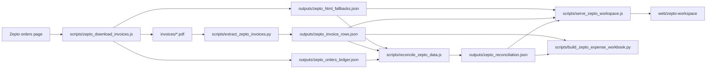

# Architecture

## Data Flow



## Runtime Layers

- Capture layer: `scripts/zepto_download_invoices.js` drives a visible Chrome session with Playwright, saves PDFs, and captures HTML fallback data.
- Parse layer: `scripts/extract_zepto_invoices.py` extracts invoice-level fields and line-item rows from PDFs.
- Reconciliation layer: `scripts/lib/zepto_reconciliation.js` merges captured orders, downloads, parsed invoices, and fallback status.
- Dataset layer: `scripts/lib/zepto_workspace_data.js` builds the dashboard dataset, line item view, source metadata, and workbench issues.
- Review layer: `scripts/lib/zepto_review_annotations.js` persists order and line-item annotations in generated JSON.
- UI layer: `web/zepto-workspace/` is a static JavaScript app served by `scripts/serve_zepto_workspace.js`.
- Export layer: `scripts/build_zepto_expense_workbook.py` writes the review workbook with openpyxl.

## Testing

JavaScript tests use Node's built-in `node:test` runner. Python tests use `pytest` but are written with `unittest` assertions.

Run:

```powershell
npm.cmd run test:js
python -m pytest scripts/tests
```
