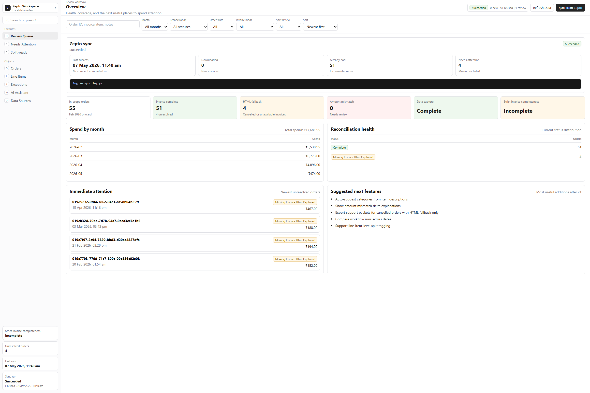
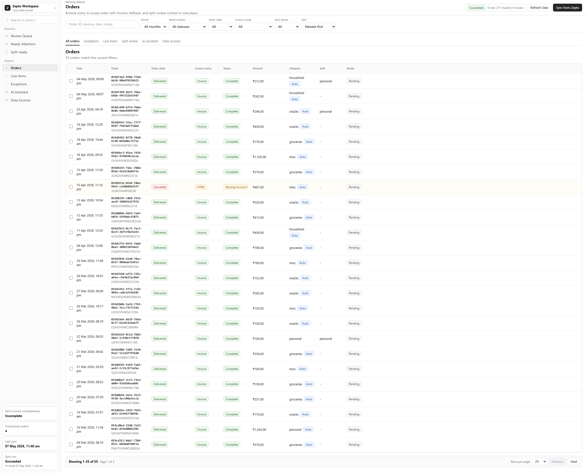
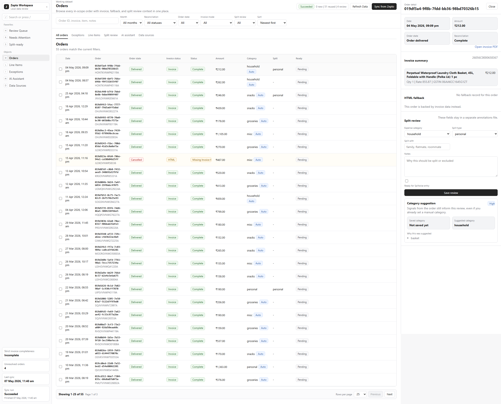
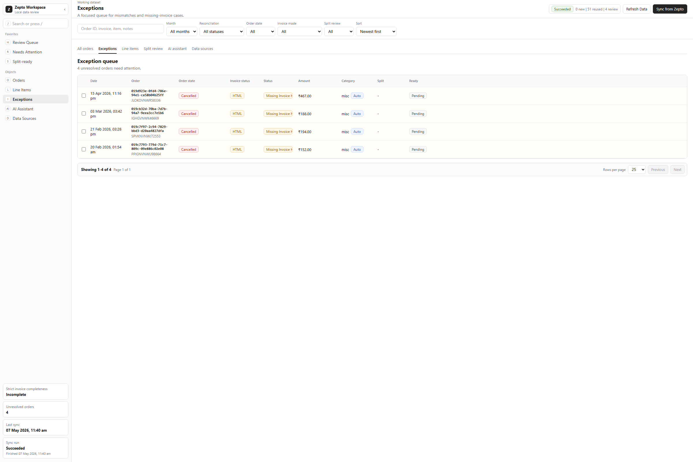
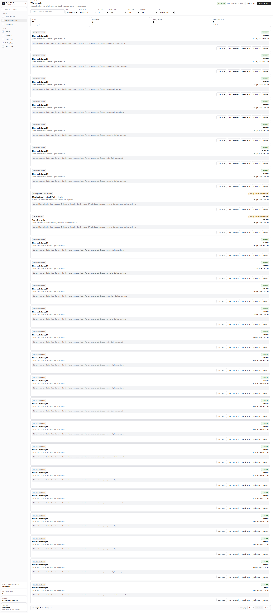
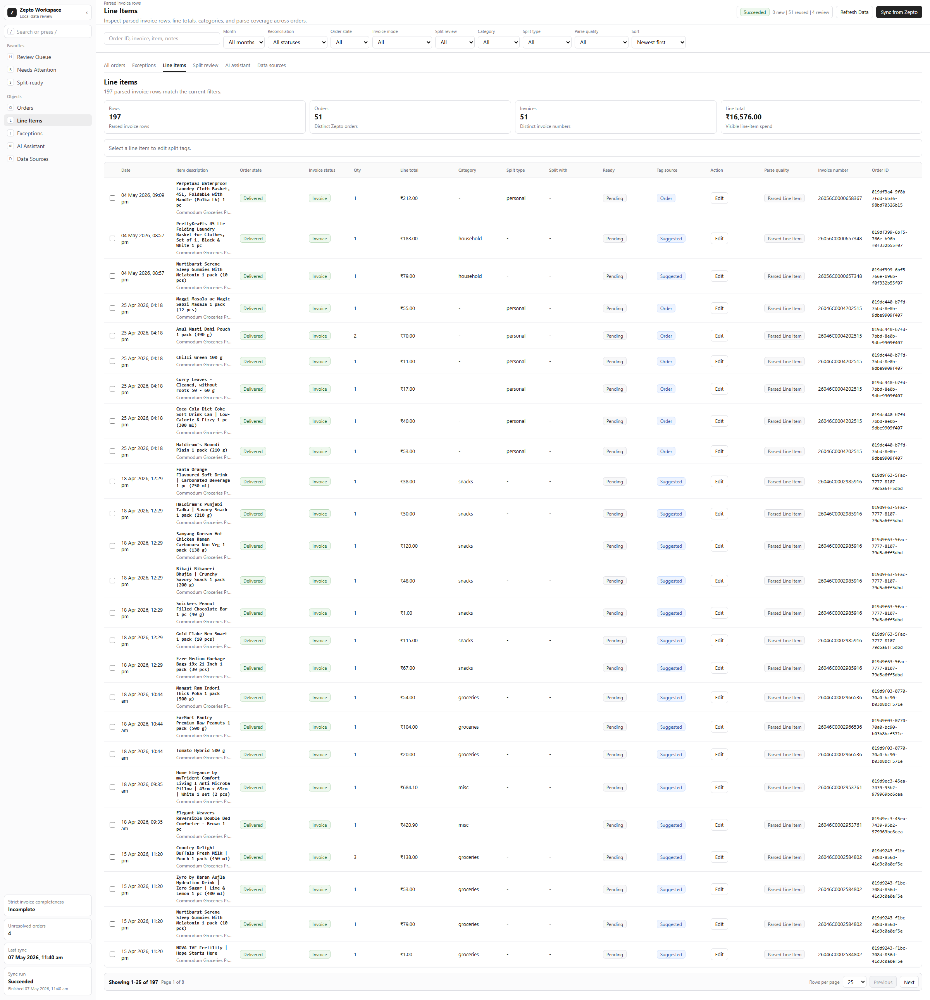
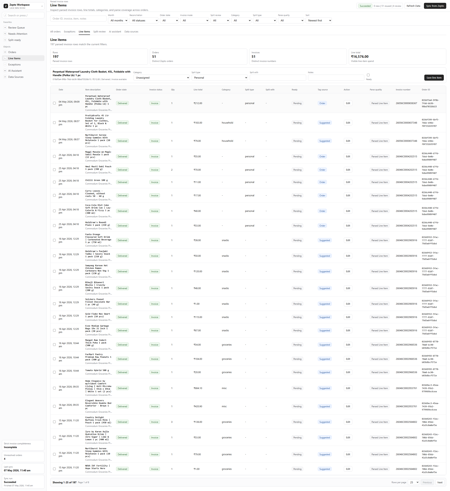
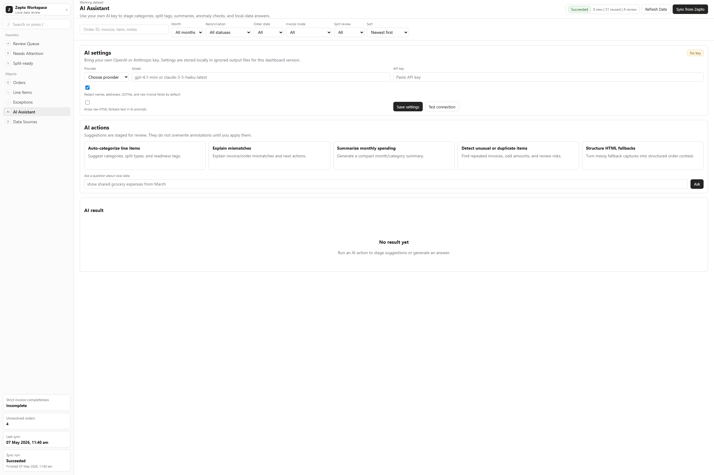
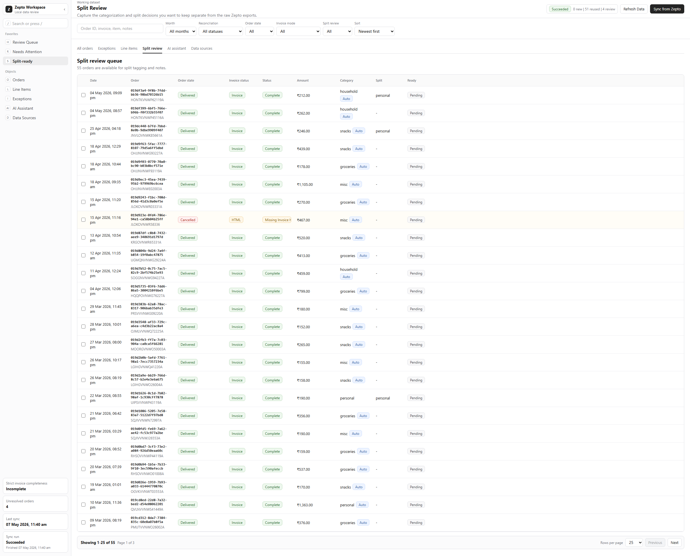
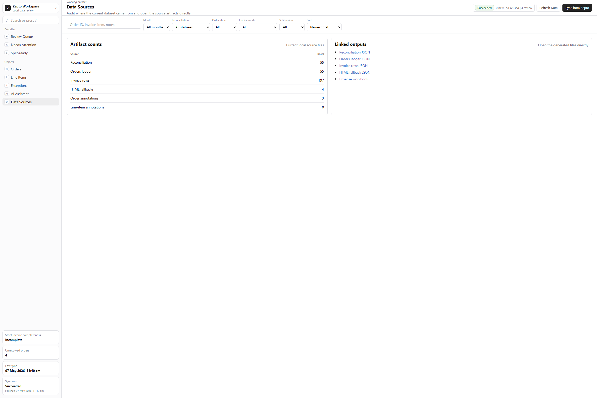

# How I Fixed Flatmate Expense Chaos: A Local Zepto Reconciliation Workspace for Shared Living

I used to spend too much time arguing about grocery expenses with my flatmate.
Most weeks the problem was not “who ordered,” it was **how we handled evidence, reconciliation, and split logic**.

In a typical bachelor flat setup, this is what happens:

- One person orders everything.
- Another person adds “just one item” and expects it to be shared.
- A refunded order slips in, and nobody remembers.
- Invoice PDFs are not always consistent, and the debate starts.

This workspace solves that pain by turning Zepto order data into a local, reviewable expense dataset.

## Why shared-living expense tracking becomes messy

Here’s the real problem I kept seeing:

1. No single source of truth.  
   Messages, screenshots, and manual notes get lost.

2. Reconciliation isn’t just “sum and split.”  
   Cancellations, discounts, and invoice differences make manual math unreliable.

3. Missing invoices break confidence.  
   Without clear fallback capture, everyone questions what was actually ordered.

4. Split rules are rarely binary.  
   Some orders are personal, some shared, some partially shared.

5. No visible exception workflow.  
   Without a workbench for exceptions, every small mismatch becomes a conversation.

## The workflow that finally worked

The workspace is local-first and opinionated around review:

1. Sync Zepto orders and captured artifacts.
2. Parse invoices into structured line-item rows.
3. Reconcile order totals against invoice totals.
4. Surface exceptions (mismatches, missing invoice, manual follow-up).
5. Tag split metadata and export a settlement-ready output.

## What changed in practice

### 1) You see everything in one view
The dashboard gives a single place for in-scope orders, invoice state, statuses, and split readiness.

### 2) Exceptions are no longer a WhatsApp argument
Missing invoices, cancellations, and mismatches are highlighted first so they can be resolved quickly.

### 3) Workbench queues make decisions explicit
You can mark review status, request retry, or flag manual follow-up directly on issue cards.

### 4) Line-item tagging fixes “partial shared” confusion
Some groceries are personal, some shared, some excluded.  
Tagging at line-item level keeps this explicit and auditable.

### 5) AI assistance is optional and review-first
Optional AI actions can suggest categories, anomalies, and monthly summaries — but results are always staged for review before applying.

### 6) Split-ready output is easier to trust
Once review is done, you can focus on items ready for settlement.

### 7) Source transparency is visible
You can inspect linked artifacts, row counts, and generated files directly from the workspace.

## Why this is better than shared spreadsheets

- **Consistent data model**: order, invoice, reconciliation, annotation, exception layers are all connected.
- **Structured disputes**: issues are traceable and quickly categorizable.
- **Better monthly closes**: line-item-level split tagging reduces back-and-forth.
- **Local by design**: outputs remain in your local workspace for privacy.

## If you are living with roommates, this is a real time saver

Most flatmate conflicts about groceries are process conflicts, not generosity conflicts.

With a reconciliation-first process:

- You can stop arguing over “who ordered what.”
- You can prove numbers with source data.
- You can split monthly cleanly with fewer retries.

## Links

- Repository: [zepto-expense-workspace](https://github.com/tejasmakesmusic/zepto-expense-workspace)
- Blog-ready screenshots and draft assets are in:
  - `docs/blog-assets/screenshots/`
  - `docs/medium-ready-zepto-flatmate-expense-workspace.md`

## Call to action

If this solved a real problem for you, please:

- Star the repo: [github.com/tejasmakesmusic/zepto-expense-workspace](https://github.com/tejasmakesmusic/zepto-expense-workspace)
- Share this post if your flatmate group has similar invoice pain
- Drop your own shared-living split strategy in the comments
